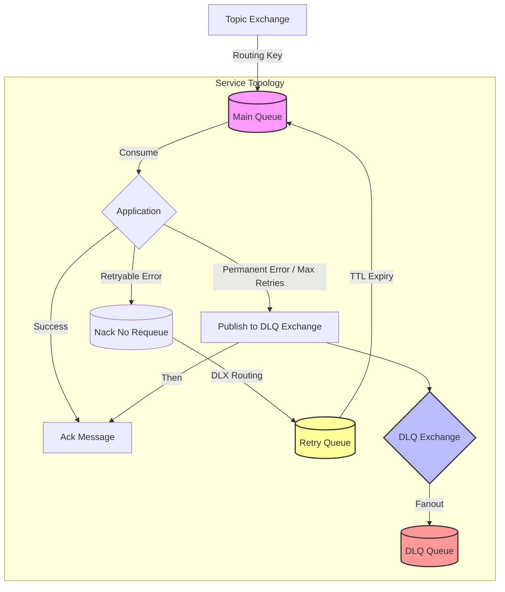

# Ratatoskr RabbitMQ Topology & Message Flow

Ratatoskr uses a robust RabbitMQ topology designed for data safety and reliable retry mechanisms, leveraging Quorum queues and a dedicated Dead Letter Exchange (DLX).

## Overview

- **Quorum Queues**: All queues (Main, Retry, DLQ) are Quorum queues by default for high availability and data safety.
- **Dedicated DLQ Exchange**: Each service/queue has a dedicated Fanout exchange for its Dead Letter Queue. This decouples the DLQ logic from the retry loop.
- **Managed Retry Loop**: Retries are handled via a "wait queue" approach using message TTLs, avoiding thread blocking in the application.

## Message Flow Diagram

## Detailed Flow

### 1. Normal Processing
- Messages arrive at the **Main Queue** (e.g., `my-service.events`).
- The application consumes the message.
- If processed successfully, the message is **Acked** and removed from the queue.

### 2. Retry Handling (Transient Failures)
- If an exception occurs (and `MaxRetries` is not exceeded):
    1. The application **Nacks** the message with `requeue=false`.
    2. The Main Queue is configured with a Dead Letter Exchange (DLX) logic pointing to the **Retry Queue** (e.g., `my-service.events.retry`).
    3. The message is moved to the **Retry Queue**.
    4. The message waits in the Retry Queue for the configured **TTL** (retry delay).
    5. Upon expiration, the Retry Queue dead-letters the message *back* to the **Main Queue** for re-processing.
    - *Note*: `x-retry-count` headers are used to track attempts.

### 3. Dead Letter Handling (Permanent Failures)
- If a **Permanent Error** occurs (e.g., validation failure) or **Max Retries** are exhausted:
    1. The application explicitly **Publishes** the message to the **DLQ Exchange** (e.g., `my-service.events.dlq`).
    2. The DLQ Exchange fans out the message to the **DLQ Queue** (e.g., `my-service.events.dlq`).
    3. The application **Acks** the original message in the Main Queue, removing it from the retry loop.

## Data Safety & Guarantees

Ratatoskr provides **At-Least-Once** delivery guarantees.

### 1. No Message Loss
- **Quorum Queues**: All queues are backed by the Raft consensus algorithm, ensuring data is replicated across nodes.
- **Publisher Confirms**: Messages are only considered "sent" when the broker confirms receipt.

### 2. Duplicate Processing
- In rare scenarios (e.g., node crash after processing but *before* Ack), a message may be redelivered.
- **Handling**: Consumers should be idempotent where possible.
- **DLQ Edge Case**: When moving a message to the DLQ, there is a small window where the message is published to the DLQ but the original is not yet Acked. If the process crashes here, the message will exist in **both** the DLQ and the Main Queue (redelivered). This ensures safety at the cost of potential duplication.

## Queue Configuration

### Main Queue (`{QueueName}`)
- **Type**: Quorum
- **x-dead-letter-exchange**: `""` (Default Exchange)
- **x-dead-letter-routing-key**: `{QueueName}.retry`

### Retry Queue (`{QueueName}.retry`)
- **Type**: Quorum
- **x-dead-letter-exchange**: `""` (Default Exchange)
- **x-dead-letter-routing-key**: `{QueueName}`
- **x-message-ttl**: `{RetryDelay}` (ms)

### DLQ Exchange (`{QueueName}.dlq`)
- **Type**: Fanout
- **Durable**: True

### DLQ Queue (`{QueueName}.dlq`)
- **Type**: Quorum
- **Bound To**: DLQ Exchange